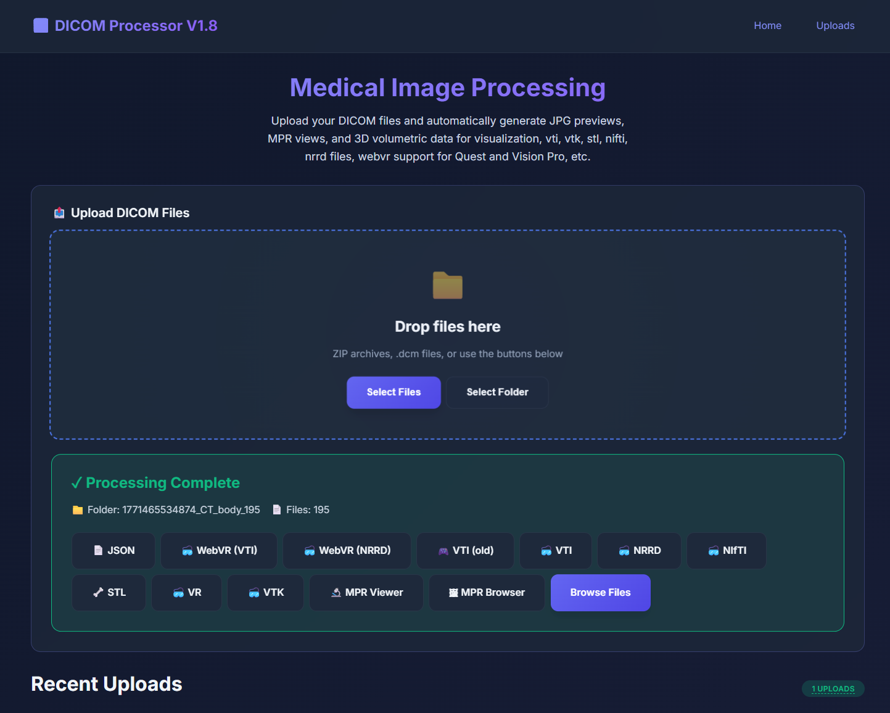
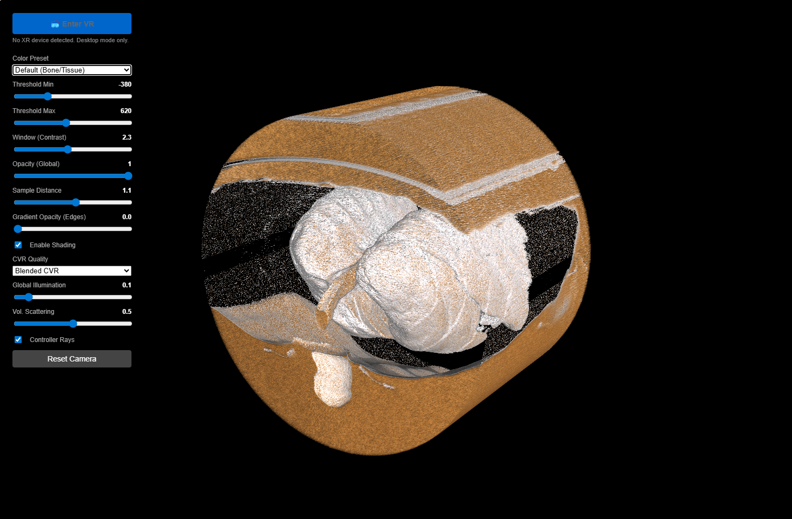

# DICOM Processor

A comprehensive web-based medical imaging platform for processing, analyzing, and visualizing DICOM data. This application handles the entire pipeline from raw DICOM upload to advanced 3D volumetric rendering and VR visualization.




## Key Features

- **Multi-Format Conversions**: Automatically converts DICOM series into:
  - **VTI / VTP** (VTK XML Image Data / PolyData)
  - **NRRD** (Nearly Raw Raster Data)
  - **NIfTI** (.nii)
  - **STL** (Stereolithography for 3D printing)
  - **Legacy VTK** (.vtk)
  - **JPG** (Thumbnail previews)

- **Advanced Visualization**:
  - **Volume Rendering**: Ray-casting based 3D visualization of soft tissues and bone.
  - **MPR (Multi-Planar Reconstruction)**: View cross-sections in Axial, Sagittal, and Coronal planes.
  - **WebVR / WebXR**: Immersive VR experience for Oculus Quest and Apple Vision Pro.
  - **Mesh Rendering**: View generated STL models.

## Project Structure

### Public Assets (`public/`)
The frontend is built with vanilla HTML/JS and served statically.

- **`index.html`**: Main landing and upload dashboard.
- **Viewers**:
  - **`webvr-viewer.html`**: VR-ready viewer using WebXR (works on Headsets).
  - **`volume-viewer.html`**: Standard desktop 3D volume renderer using `vtk.js`.
  - **`mpr-viewer.html`**: Multi-planar reconstruction viewer.
  - **`stl-viewer.html`**: Basic viewer for STL surface meshes.
  - **`nifti-viewer.html`**: Specialized NIfTI format viewer.
  - **`folder-viewer.html`**: File browser for inspected uploaded directories.

### Backend Source (`src/`)
Node.js Express server handling uploads, file processing, and conversion.

- **`app.js`**: Application entry point and server configuration.
- **`routes/uploads.js`**: Handles file uploads, zip extraction, and initiates processing.
- **`converters/vtk.js`**: Logic for converting raw DICOM pixel data into VTK formats.
- **`services/processor.js`**: Orchestrates the conversion pipeline.

## Setup Instructions

### Prerequisites
- [Node.js](https://nodejs.org/) (v16+ recommended)
- [NPM](https://www.npmjs.com/)

### Installation

1. **Clone the repository**:
   ```bash
   git clone <repository-url>
   cd upload_dicom
   ```

2. **Install dependencies**:
   ```bash
   npm install
   ```

### Running the Application

1. **Development Mode** (with auto-reload):
   ```bash
   npm run dev
   ```

2. **Start Server**:
   ```bash
   npm start
   ```

3. **Build WebXR Bundle** (if modifying VR code):
   ```bash
   npm run build:webxr
   ```

4. **Access the application**:
   Open http://localhost:3000

## Usage Guide

1. **Upload**: Drag & drop a `.zip` file containing DICOM images or a folder of `.dcm` files onto the upload zone.
2. **Process**: The server will automatically extract and convert the files. Progress is shown in real-time.
3. **Visualize**: Once complete, click the action buttons to:
   - **📄 JSON**: Inspect metadata.
   - **🥽 VR (VTI/NRRD)**: Launch the VR experience.
   - **🥽 VTI / NRRD**: Open the desktop volume viewer.
   - **🦴 STL**: View the extracted surface mesh.
   - **🔬 MPR**: Analyze cross-sectional slices.

## Dependencies

- **Backend**: `express`, `multer`, `unzipper`, `@kitware/vtk.js`
- **Frontend**: `vtk.js`, `itk-wasm` (for some conversions)

## License

This project is licensed under the MIT License.